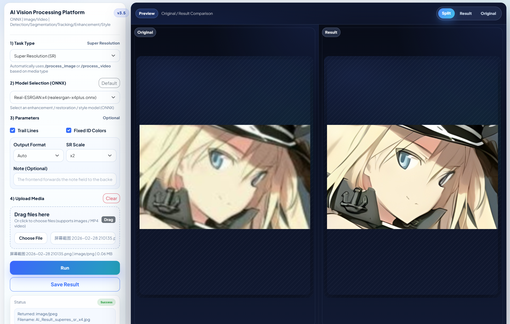
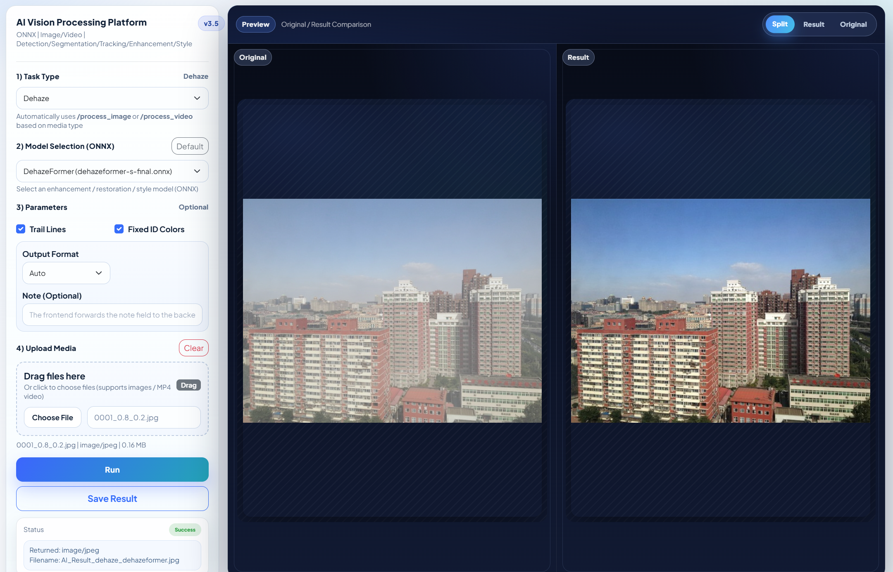

# Unified Image Processing Toolkit

[](LICENSE)
[](https://isocpp.org/)
[](https://cmake.org/)
[](https://opencv.org/)
[](https://onnxruntime.ai/)
[](https://github.com/sc-30-bit/Unified-Image-Processing-Toolkit)

One C++ toolkit for enhancement, restoration, detection, segmentation, tracking, and style workflows on images and videos.

Built with ONNX Runtime, OpenCV, and FFmpeg, with a lightweight local web UI for quick testing and deployment.

## Demo

| Super Resolution | Dehaze |
|---|---|
|  |  |

| Derain | Underwater |
|---|---|
|  |  |

| Colorization | Style Transfer |
|---|---|
|  |  |

### Tracking

<video
  src="https://github.com/user-attachments/assets/d2f79049-64ec-4f50-8675-e721d3980909"
  controls
  muted
  playsinline
  style="max-width:100%;">
</video>

## What It Does

- Image and video processing in one local C++ application
- ONNX Runtime inference backend
- OpenCV-based preprocessing, rendering, and postprocessing
- YOLO-based detection, segmentation, and tracking
- Restoration workflows for super resolution, dehaze, derain, desnow, underwater enhancement, and old-photo repair
- Colorization and style transfer support
- Lightweight browser UI served directly by the C++ backend

## Supported Tasks

`superres` · `dehaze` · `derain` · `desnow` · `underwater` · `old_photo` · `colorization` · `style` · `detect` · `segment` · `track`

## Quick Start

### Requirements

- C++17 compiler
- CMake 3.16+
- ONNX Runtime
- OpenCV
- FFmpeg

### Build

```bash
cmake -S . -B build
cmake --build build --config Release
```

### Run

Start the executable and open the local UI in your browser:

```text
http://localhost:8080
```

## Downloads

- [`ONNX Runtime`](https://drive.google.com/file/d/1E7reoxk0ln9yrhMNrSOcXkY-Oaymf2ID/view?usp=sharing)
- [`OpenCV`](https://drive.google.com/file/d/1vMUZDDs9yxp9ZMFxr0lSmQsg7zE6jVDi/view?usp=sharing)
- [`FFmpeg`](https://drive.google.com/file/d/1swzGBN0k6Wvu9VqHeoPv9MLQZtIpLEXr/view?usp=sharing)
- [`Weights pack`](https://drive.google.com/file/d/1OyZCqlJv7gblpH75rBOwpRvhTayYorFl/view?usp=sharing)

## Project Structure

```text
.
+-- CMakeLists.txt
+-- README.md
+-- LICENSE
+-- include/
|   +-- basemodel.h
|   +-- colorizer.h
|   +-- draw_utils.h
|   +-- httplib.h
|   +-- ModelTypes.h
|   +-- restoration.h
|   +-- tracker.h
|   \-- yolo.h
+-- src/
|   +-- basemodel.cpp
|   +-- colorizer.cpp
|   +-- main.cpp
|   +-- restoration.cpp
|   \-- yolo.cpp
+-- web/
|   \-- index.html
+-- figs/
\-- weights/   # local only, not committed
```

## Notes

- Model weights are not committed to this repository.
- Third-party runtime binaries should be downloaded separately.

## License

[`Apache License 2.0`](LICENSE).
